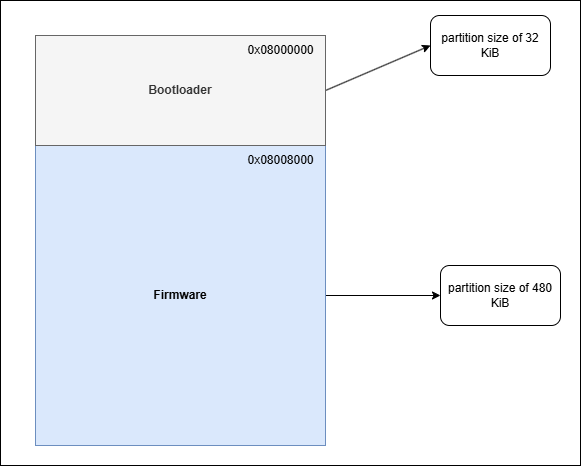
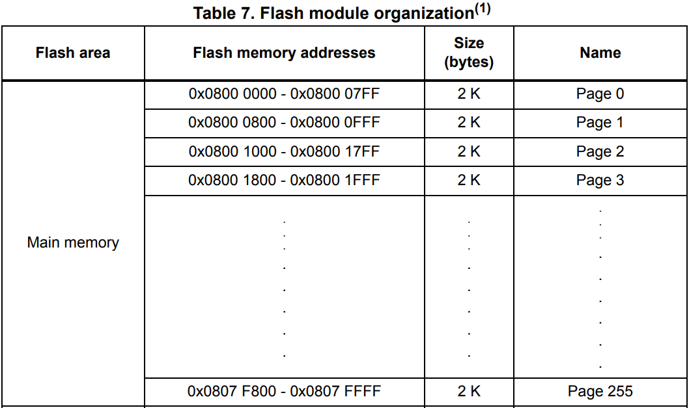

# simple bootloader

This simple bootloader for the NucleoF303RE is a hobby project of mine, in no way is this bootloader meant to replace or compete with other bootloaders.

## Flash partition  
As seen in the image below, the flash memory has been divided up into 2 partitions: 1 partition for the bootloader (32 KiB) and 1 partition for the main application (480 KiB). These sizes and their starting addresses are set in the linkerscript (.ld)    
   

It is important for both the bootloader and the main application that they are aligned at 2 KiB, as the flash memory consists of 2 KiB pages.
   

Left over bytes in the last used page is filled up with 0xFF.